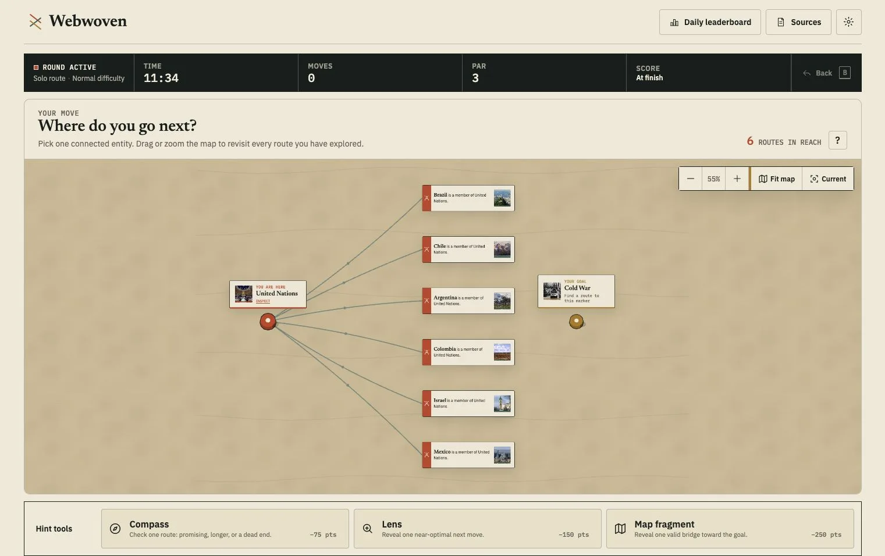
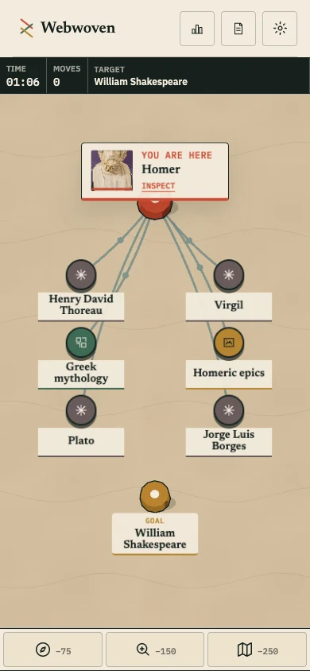

# Webwoven

**Connect anything. Discover why it is connected.**

[Play live](https://www.webwoven.org) ·
[Technical docs](https://www.webwoven.org/docs/) ·
[Privacy](https://www.webwoven.org/privacy)

Webwoven is a competitive, explainable knowledge-graph game. Players move between real people,
places, events, works, species, and scientific ideas by following named relationships—not opaque
hyperlinks. Every move answers both _where can I go?_ and _why are these things connected?_


The project is also an open Build Week case study for a simple belief:

> Everyone with an idea can become a game developer.

Codex turns the product brief into a modular, tested game, a validated knowledge atlas, and a
living public build journal. Game rules, visible-choice projection, scores, and winners remain
deterministic and server-authoritative; Solo and Lobby assignments are random but history-aware,
while the shared Daily is pinned deterministically.

## Build Week release

The complete Build Week release is live: Single player, a shared Daily challenge, synchronized
Multiplayer Lobbies, responsive graph exploration, source inspection, deterministic hints, and
cookie-free aggregate reporting. The production atlas publishes 100 validated round definitions:
curated start/goal pairs rather than fixed paths through the graph. The final playtest pass added
shareable Lobby links and same-Lobby rematches, complete mobile labels and a compact phone HUD, a
reachable-target heartbeat, completion confetti, and route-aware dead-end recovery. The public
repository, narrated demo, judge path, and Devpost draft are prepared; the final submission remains
an explicit owner action.

## Built with Codex and GPT-5.6

I brought the original game concept, set the product boundaries, and made the final design,
editorial, infrastructure, and release decisions. The primary implementation task ran on
**GPT-5.6 Sol in Codex**. Codex turned the brief into the Svelte client, FastAPI domains, knowledge
pipeline, tests, operations, and living documentation, while specialized parallel tasks worked
against the same contracts and were reviewed through the shared quality gate.

Codex was most valuable where the project needed breadth without losing coherence: it could build
the graph compiler while another task implemented the API, then exercise both through real browser
flows and revisit problems found during hands-on play. I steered the choices that define the final
product—including named rather than opaque connections, a deterministic server-authoritative
runtime, complete source provenance, an editorial-atlas visual system, and no production AI
dependency.

A detailed concept brief existed before the challenge. The working repository begins with the July
13 foundation commit after the submission period opened; the dated commit history and public
[Build Week journal](docs/build-log/2026-07-13.md) distinguish the implementation from that earlier
brief. The result is not a generated mock-up: it is a deployed, completely open-source game with a
reproducible data build and tested production stack.

## What you can play

- **Single player** — choose a difficulty and find a route at your own pace.
- **Daily challenge** — solve the same connection as everyone else and compare scores.
- **Multiplayer** — race live with two to four players using shareable Lobby links, reconnect, a
  30-second grace countdown, and same-Lobby rematch voting.

Solo players and Multiplayer hosts can leave the whole atlas open or filter the start and goal to
one of ten topics. The connecting route may still cross categories, preserving the graph's
surprising bridges. Daily category and difficulty remain shared, curated assignments.

A round reveals a start, a goal, category, and difficulty. The server retains the known shortest
distance for scoring without presenting a Par field during play. Each move follows one documented
graph relationship. Players can inspect the underlying fact, documentary image, attribution, and
preferred Wikipedia article without changing position. Efficient routes score best; three
deterministic hint tools trade points for guidance.

Automatic Single player, Multiplayer, and new Daily assignments begin with at least two distinct
destinations. During play, route-aware reachability prevents a decision from presenting only false
dead ends when a target-reaching continuation exists. Explicit replay IDs and already-pinned Daily
assignments remain reproducible.

The route atlas expands as you play: desktop and tablet preserve a left-to-right map with navigation
and hints in a lightweight side rail, while phones project the same deterministic graph into a
top-to-bottom two-column constellation. Phone labels wrap without ellipses and share the tallest
label height within each row. Choices preview on the first tap and confirm on the second; on every
layout, activating the immediately previous node twice performs Back. Earlier branches remain
visible and inspectable without placing controls over the node canvas, and a reachable goal uses a
reduced-motion-aware heartbeat on desktop and mobile.



### The same atlas on a phone



## The current atlas

- 3,970 playable Wikidata entities and 22,402 directed, named relationships
- ten readable knowledge categories
- 100 validated, published round definitions (start/goal pairs): 4 Easy, 4 Normal, and 2 Hard per
  category; the path between each pair remains open
- fact-aware, direction-stable relationship sentences with source ranks preserved when present
- local, policy-checked Commons media for every entity through 3,621 attributed source files
- 3,778 preferred Wikipedia article links
- no Wikidata, Commons, Wikipedia, or AI request during gameplay

The synthetic smoke fixture is test-only. Normal gameplay requires an immutable real-data bundle
and fails visibly if one is unavailable.

## How it is built

| Layer                  | Responsibility                                                                         |
| ---------------------- | -------------------------------------------------------------------------------------- |
| Svelte 5 + TypeScript  | Accessible game UI, responsive modes, and semantic controls                            |
| Three.js               | Decorative atlas paper, paths, and tokens; gameplay remains usable without WebGL       |
| FastAPI                | Authoritative sessions, route projection, hints, scoring, Daily, and Multiplayer rules |
| SQLite atlas           | Immutable compiled Wikidata entities, relationships, rounds, and media records         |
| PostgreSQL + Valkey    | Durable player state and low-latency multiplayer coordination                          |
| Python pipeline        | Versioned Wikidata acquisition, Commons licensing, validation, and compilation         |
| Caddy + Docker Compose | TLS, same-origin routing, health-checked production releases, and backups              |
| Self-hosted Umami      | Cookie-free page views and five allowlisted aggregate product events                   |

Runtime boundaries keep the network, persistence, UI, and game domains separate. See the
[architecture overview](docs/architecture/overview.md) and
[production system map](docs/architecture/system-map.md), then the detailed
[responsibility map](docs/development/responsibility-map.md).


## Run locally

Prerequisites: Node 24+, Corepack, Python 3.13, uv, Docker, and Just.

Build and activate the real Wikidata playtest pack by following the
[data pipeline guide](docs/data/pipeline.md), then run the complete same-origin stack:

```sh
cp .env.example .env
just install
docker compose up -d --build
```

Open `http://localhost`. Replace the example signing secrets before sharing the stack beyond your
machine. No AI account, key, or runtime service is required to build or play Webwoven.

For hot-reload development, start the infrastructure, API, and Vite client separately:

```sh
just dev-infra
just dev-api
just dev-web
```

### Local test surfaces

| Surface              | URL                     | Data and purpose                                                                           |
| -------------------- | ----------------------- | ------------------------------------------------------------------------------------------ |
| Compose acceptance   | `http://localhost`      | Compiled Caddy client, real API, and active Wikidata pack. Canonical manual product check. |
| Split development    | `http://localhost:5173` | Vite hot reload against the separately running API on `:8000`.                             |
| Playwright isolation | `http://127.0.0.1:4173` | Temporary demo-mode server owned by `pnpm test:e2e`; automated tests only.                 |
| API only             | `http://localhost:8000` | FastAPI endpoints and health checks; no product UI.                                        |

Every verification note names its surface and URL. After frontend changes, rebuild Compose with
`docker compose build caddy && docker compose up -d caddy`, reload `http://localhost`, and verify
there before reporting acceptance. A `:4173` result never substitutes for the real-data stack.

## Quality gate

```sh
just check
pnpm test:e2e
```

The current repository gate passes 164 web tests, 363 Python tests, 48 desktop/mobile Playwright flows, and
both Remotion composition checks. The complete gate also covers formatting, linting, type checking,
file-size limits, strict documentation builds, deterministic data validation, and container builds
in CI.

## Documentation

- [Game rules](docs/product/game-rules.md)
- [Architecture](docs/architecture/overview.md)
- [Production system map](docs/architecture/system-map.md)
- [Data pipeline and provenance](docs/data/pipeline.md)
- [Local setup and testing surfaces](docs/development/setup.md)
- [Build Week journal](docs/build-log/2026-07-19.md)
- [Deployment](docs/operations/deployment.md)
- [Devpost submission draft](docs/submission/devpost.md)

Run `uv run mkdocs serve` for the complete living documentation.

## License

Source code and authored documentation are MIT licensed. Imported Wikidata data and Wikimedia
Commons assets retain their source licenses and are covered by build-specific attribution
manifests and `THIRD_PARTY_NOTICES.md`. Screenshot-specific notices are recorded in
[`docs/assets/screenshots/README.md`](docs/assets/screenshots/README.md).
