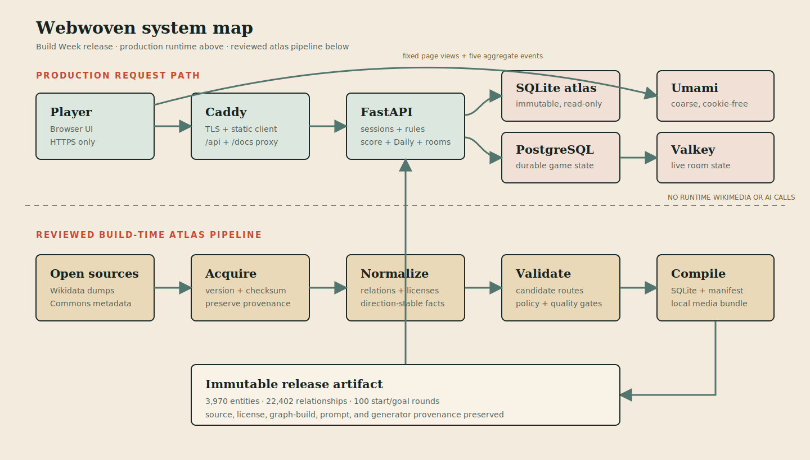

# Production system map

Webwoven's complete Build Week release is live at
[www.webwoven.org](https://www.webwoven.org). The deployed product includes Single player, Daily
challenge, synchronized Multiplayer Lobbies, responsive route exploration, source inspection,
deterministic route-safe navigation, and privacy-minimized aggregate reporting. The submission
diagram reflects the single production runtime shared by all three modes and the offline build-time
atlas pipeline.

## Runtime boundary

The browser reaches one public Caddy edge. Caddy terminates TLS, serves the compiled Svelte client
and MkDocs site, redirects the apex domain to the canonical `www` host, and proxies API and room
traffic to FastAPI. FastAPI is the only owner of authoritative gameplay rules.

| Domain                  | Owner                                                              | State and dependencies                                                 |
| ----------------------- | ------------------------------------------------------------------ | ---------------------------------------------------------------------- |
| Presentation            | Svelte semantic controls plus a presentation-only Three.js/SVG map | Versioned API contracts; no game-rule ownership                        |
| Navigation and sessions | FastAPI session domain                                             | Frozen decision frames, signed active choices, replayable versions     |
| Graph access            | `GraphReader`                                                      | Indexed, immutable SQLite atlas mounted read-only                      |
| Scoring and hints       | Pure server domain services                                        | Pinned rule versions and deterministic penalties                       |
| Multiplayer rooms       | Room service                                                       | PostgreSQL durability plus Valkey streams, expiry, and reconnect state |
| Reporting               | Small client allowlist plus self-hosted Umami                      | Cookie-free page views and five coarse events; never blocks gameplay   |
| Edge and operations     | Caddy and Compose deployment scripts                               | TLS, same-origin routing, health checks, backups, and retention        |

A gameplay request never reaches Wikidata, Wikimedia Commons, Wikipedia, or an AI service. All
entity facts, links, and licensed images are served from the reviewed release bundle. A session pins
its graph, content, route-generator, and scoring versions so a recorded route can be reproduced.

## Build-time knowledge pipeline

The Python pipeline is deliberately outside the production request path:

1. Versioned Wikidata and Commons inputs are acquired and checksummed.
2. Entities, readable relation directions, source ranks, article links, and media licenses are
   normalized into owned domain records.
3. Candidate routes are generated and rejected unless they satisfy graph, choice, content, media,
   and policy checks.
4. Approved records compile into an immutable SQLite graph, local media directory, manifest, and
   attribution ledger.
5. Deployment verifies the manifest checksum before activating a release.

Codex can assist with build artifacts and documentation, but those artifacts are reviewed and
labelled at build time. Codex is not a production dependency and does not decide moves, scores,
routes, or winners.

## Production topology

The current Hetzner deployment runs the public edge, API, application PostgreSQL, Valkey, Umami,
and a separate analytics PostgreSQL service under Docker Compose. Umami's direct port is bound to
loopback; only Caddy publishes the dashboard and tracker. Application and analytics databases are
backed up independently, and aggregate analytics rows have a 90-day retention job.

| Public address               | Purpose                                              |
| ---------------------------- | ---------------------------------------------------- |
| `https://www.webwoven.org`   | Canonical game, API, privacy page, and documentation |
| `https://webwoven.org`       | Permanent redirect to the canonical host             |
| `https://stats.webwoven.org` | Self-hosted analytics tracker and private dashboard  |

## Production release snapshot

- 3,970 playable entities and 22,402 named directed relationships
- ten knowledge categories and 100 validated, published start/goal round definitions
- 3,621 locally served, attributed Commons source files
- Single player, shared Daily challenge, and two-to-four-player synchronized Multiplayer Lobbies
- deep-link invitations with explicit confirmation, reconnect, grace deadlines, and same-code rematch voting
- desktop/tablet left-to-right atlas and phone top-to-bottom two-column constellation
- deterministic hints, scoring, route-aware dead-end recovery, Back, and replayable session versions
- full mobile label wrapping, compact phone chrome, and reduced-motion-aware completion effects

The repository quality gate passes 164 web tests, 363 Python tests, 48 desktop/mobile Playwright
flows, and both Remotion composition checks, alongside formatting, lint, type checking, strict
documentation, data validation, and container-build checks. The detailed domain boundaries remain
in the [architecture overview](overview.md) and
[responsibility map](../development/responsibility-map.md).
