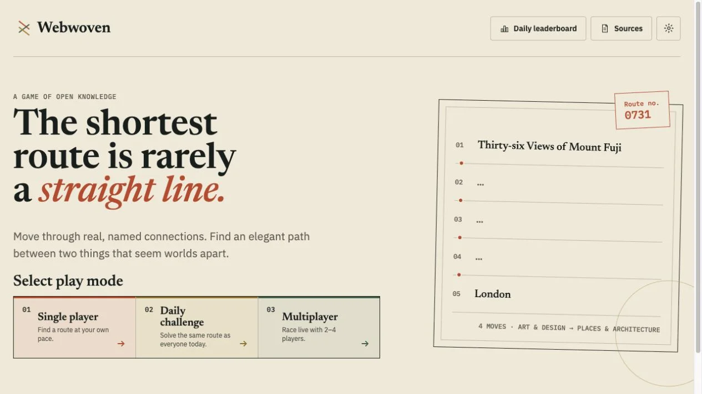

# Webwoven

Webwoven is an explainable knowledge-graph game built for OpenAI Build Week.

> Connect anything. Discover why it is connected.

Players travel from a known start to a known target by following real, named relationships.
Every move answers not only _where can I go?_ but _why are these things connected?_

## Three ways to play

- **Single player** for a difficulty-selected route at your own pace
- **Daily challenge** for one shared route and leaderboard
- **Multiplayer** for a synchronized live race with two to four players

Each mode uses the same immutable, explainable atlas. A player can inspect the documented fact,
licensed image, and preferred Wikipedia article behind a node without spending a move.
Automatic assignments begin with at least two distinct destinations, and every direction presents
the same fact-aware relationship sentence.

## Two promises

The product promise is a fair and visually distinctive knowledge game. The build promise is that
**everyone with an idea can become a game developer** when an AI collaborator is paired with a
clear brief, testable decisions, and visible human judgment.

The documentation is maintained with the implementation. It records architecture, data
provenance, AI boundaries, tests, operations, and concise Build Week milestones.

## Current milestone

Webwoven is live at [www.webwoven.org](https://www.webwoven.org) halfway through Build Week. Single
player, Daily challenge, synchronized Multiplayer, responsive route exploration, source inspection,
and privacy-minimized reporting all run against an immutable, release-scale Wikidata bundle with
locally served, policy-checked Commons media for every graph entity.
The active atlas contains 3,970 entities, 22,402 named relationships, 100 validated choice-first
candidates, 40 published routes, and ten categories. The synthetic smoke graph remains test-only.
The remaining release work is accessibility, security and load verification, content review, demo
recording, and submission packaging.

Start with the [game rules](product/game-rules.md), [system map](architecture/system-map.md),
[architecture](architecture/overview.md),
[data pipeline](data/pipeline.md), or the [current build log](build-log/2026-07-17.md).
